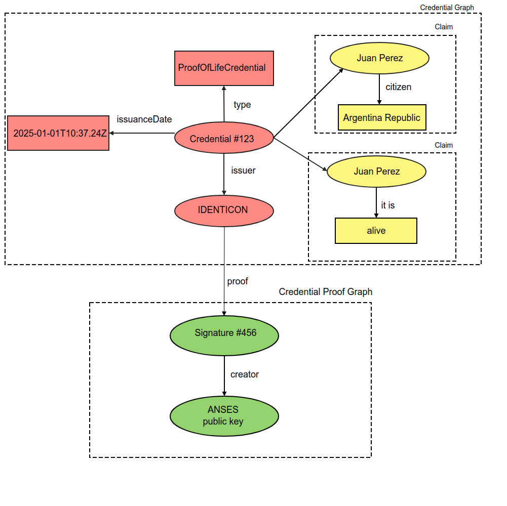

# `Credencial verificable`

## Qué es

Tal y como fue conceptualizado y estandarizado por el W3C en [Verifiable Credentials Data Model v1.1](https://www.w3.org/TR/vc-data-model/), la credencial verificable puede representar toda la misma información que representa una credencial física. La adición de tecnologías, como las firmas digitales, hace que las credenciales verificables sean más seguras y más fiables que sus homólogas físicas.

Los titulares de credenciales verificables pueden generar presentaciones verificables y luego compartir estas presentaciones verificables con los verificadores para demostrar que poseen credenciales verificables con determinadas características.

Tanto las credenciales verificables como las presentaciones verificables pueden transmitirse rápidamente, lo que las hace más convenientes que sus homólogas físicas cuando se trata de establecer la confianza a distancia.

## Funciones 

Describimos los roles de los actores principales y las relaciones entre ellos en un ecosistema donde se espera que las credenciales verificables sean útiles. Un rol es una abstracción que puede implementarse de muchas maneras diferentes.

#### Titular
: Un papel que una entidad puede desempeñar al poseer una o más credenciales verificables y generar presentaciones verificables a partir de ellas. Algunos ejemplos de titulares son los estudiantes, los empleados y los clientes.

#### Emisor
: Función que desempeña una entidad al afirmar afirmaciones sobre uno o más sujetos, crear una credencial verificable a partir de estas afirmaciones y transmitir la credencial verificable a un titular. Algunos ejemplos de emisores son las empresas, las organizaciones sin ánimo de lucro, las asociaciones comerciales, los gobiernos y los particulares. 

: **Identicon actuará en nombre del emisor**.

#### Sujeto
: Entidad sobre la que se hacen reclamaciones. Algunos ejemplos de sujetos son los seres humanos, los animales y las cosas. En muchos casos, el titular de una credencial verificable es el sujeto, pero en algunos casos no lo es. Por ejemplo, un padre (el titular) puede tener la credencial verificable de un hijo (el sujeto), o el dueño de una mascota (el titular) puede tener la credencial verificable de su mascota (el sujeto). Para más información sobre estos casos especiales.

#### Verificador
: Función que desempeña una entidad al recibir una o más credenciales verificables, opcionalmente dentro de una presentación verificable, para su procesamiento. Algunos ejemplos de verificadores son los empleadores, el personal de seguridad y los sitios web.

#### Registro de datos verificables
: Una función que un sistema podría desempeñar al mediar la creación y verificación de identificadores, claves y otros datos relevantes, como esquemas de credenciales verificables, registros de revocación, claves públicas de emisores, etc., que podrían ser necesarios para utilizar credenciales verificables. Algunas configuraciones podrían requerir identificadores correlativos para los sujetos.
Algunos ejemplos de registros de datos verificables son las bases de datos de confianza, las bases de datos descentralizadas, las bases de datos de identificación del gobierno y los libros de contabilidad distribuidos. A menudo hay más de un tipo de registro de datos verificable utilizado en un ecosistema.

: **Identicon utilizará la [cadena de bloques NEAR](http://near.org) para representar el registro de datos verificable**.

<figure markdown>
{ width="480px", align="left" }
</figure>

## Modelo de datos básico

Las siguientes secciones describen los conceptos del modelo de datos básicos, como las reclamaciones, las credenciales y las presentaciones, que constituyen la base de esta especificación.

#### Reclamación

: Una reclamación (claim) es una afirmación sobre un tema. Un tema es una cosa sobre la que se pueden hacer afirmaciones. Las reivindicaciones se expresan mediante relaciones sujeto-propiedad-valor.

<figure markdown>
{ width="480px"}
</figure>

: Por ejemplo, si alguien se ha graduado en una determinada universidad puede expresarse como se muestra en la Figura 3.

<figure markdown>
{ width="480px"}
</figure>

#### Credencial
: Una credencial es un conjunto de una o varias afirmaciones realizadas por la misma entidad. Las credenciales también pueden incluir un identificador y metadatos que describan las propiedades de la credencial, como el emisor, la fecha y la hora de caducidad, una imagen representativa, una clave pública para su verificación, el mecanismo de revocación, etc. Los metadatos pueden estar firmados por el emisor. Una credencial verificable es un conjunto de afirmaciones y metadatos a prueba de manipulaciones que demuestran criptográficamente quién la ha emitido.

<figure markdown>
{ width="480px"}
</figure>

: **Metadatos**:

: Firmados criptográficamente por el emisor. Describe las propiedades de la credencial, como el emisor, la fecha y la hora de caducidad, una imagen representativa, una clave pública para su verificación, el mecanismo de revocación, etc.". (W3C)

: **Pruebas**:

: Una prueba es un dato sobre ti mismo (el titular de la identidad) que permite a otros verificar la fuente de los datos (es decir, el emisor), comprobar que los datos te pertenecen (y sólo a ti), que los datos no han sido manipulados y, por último, que los datos no han sido revocados por el emisor.

#### Un ejemplo: la "Fe de vida"

- **Titular:  Ciudadano de Argentina**
- **Emisor: Identicon en nombre de ANSES**
- **Verificador: Entidad bancaria - trata de asegurar la prueba de vida para el reclamo de la pensión**

## Ventajas

#### Privadas 

Las credenciales verificables son privadas.

* El titular de la identificación puede elegir qué atributos de su identidad quiere revelar. Por ejemplo, puede mostrar su año de nacimiento sin revelar el día y el mes en que nació.

* El titular de la identidad tiene siempre el control de la relación con los verificadores de identidad. Sabe qué datos se han compartido y cuándo (hay un registro de auditoría) y puede revocar esa relación en cualquier momento.

* Son a prueba de manipulaciones gracias al uso de la criptografía.

* Las credenciales verificables pueden ser verificadas en cualquier lugar y en cualquier momento. Incluso si el emisor ya no existe (con la excepción de situaciones en las que la emisión de credenciales se produjo utilizando DIDs privados y el DID del emisor no se escribió en el libro de contabilidad).

#### Portable 

Las credenciales verificables son tuyas para almacenarlas en tu cartera y compartirlas con quien quieras. El titular de la credencial no está "encerrado" en la organización que la emitió.

#### Presentaciones verificables

Mejorar la privacidad es una característica de diseño clave de esta especificación. Por lo tanto, es importante que las entidades que utilicen esta tecnología puedan expresar sólo las partes de su persona que sean apropiadas para una situación determinada. La expresión de un subconjunto de la propia persona se denomina presentación verificable. Entre los ejemplos de personas diferentes se encuentran la persona profesional de una persona, su persona de juego en línea, su persona familiar o una persona de incógnito.

Una presentación verificable expresa datos de una o más credenciales verificables, y está empaquetada de tal manera que la autoría de los datos es verificable. Si las credenciales verificables se presentan directamente, se convierten en presentaciones verificables. Los formatos de datos derivados de credenciales verificables que son verificables criptográficamente, pero que no contienen por sí mismos credenciales verificables, también pueden ser presentaciones verificables.

Los datos de una presentación suelen ser sobre el mismo tema, pero pueden haber sido emitidos por múltiples emisores. El conjunto de esta información suele expresar un aspecto de una persona, organización o entidad.

<figure markdown>
{ width="480px"}
</figure>

**Ejemplo de presentación verificable**

- **Titular**:  Ciudadano de Argentina
- **Emisor**: Identicon en nombre de ANSES
- **Verificador**: Entidad Bancaria - trata de asegurar la prueba de vida para el reclamo de la pensión

<figure markdown>
{ width="560px"}
</figure>

## NFTs y Credenciales Verificables (VC)

### Similitudes

**Aprovecha el mundo digital**

Los NFT, en particular, ofrecen a los propietarios nuevas fuentes de ingresos y formas de monetización. Por ejemplo, un grupo musical puede crear un single exclusivo y venderlo como NFT, de modo que el nuevo propietario tiene los derechos de todos los derechos de autor derivados del mismo.
Los VC también aprovechan la infraestructura digital para eliminar los fraudes que surgen en el mundo físico, convirtiendo todas las credenciales importantes en un formato digital fácil de compartir. Una empresa emergente, por ejemplo, puede encargarse de convertir las identidades físicas en digitales seguras y, a su vez, cobrar una cuota al propietario de la credencial por este servicio.

**Identificación única**

Tanto los NFT como las CV se utilizan para identificar de forma única algo que pertenece a una entidad. Los NFT suelen implementarse para representar una pieza de arte única o un objeto de colección que pertenece a una entidad. Demuestra que un artículo concreto es auténtico tal y como se reclama y pertenece únicamente a una entidad. Por ejemplo, un NFT puede utilizarse para demostrar que Lisa es la propietaria de una tarjeta de Pokemon coleccionable.

Las CV también se utilizan para demostrar que una afirmación hecha por una entidad es verdadera. Esta afirmación puede consistir en credenciales como el PII, el título universitario, etc. En este caso, un club de juegos puede emitir una CV a Lisa para afirmar que es la directora de su club de encuentro pokemon.
En este sentido, tanto las NFTs como las VCs demuestran que algo pertenece a una entidad y esto podría ser cualquier cosa, desde una PII hasta una pieza de arte.

**Inmutable**

La implementación tanto de los NFTs como de los VCs asegura que los registros son inmutables, y por lo tanto, esto añade otra capa de seguridad a estos tokens y credenciales. 
Así pues, estas son algunas de las similitudes entre las NFT y las CV

### Diferencias

**Implementación**

Una diferencia clave es que las CV utilizan una infraestructura de clave pública y firmas digitales para probar una reclamación. Hay tres entidades en una CV: el emisor (la entidad que emite una credencial), el titular (la entidad que posee la credencial) y el verificador (la entidad que verifica la credencial).

Por ejemplo, un emisor emite una credencial verificable para el permiso de conducir que pertenece a un titular. Tanto el emisor como el titular firman digitalmente la CV utilizando sus respectivas claves públicas, y estas firmas son verificadas por el verificador para autenticar que la licencia de conducir pertenece al titular.

Los NFT, por su parte, se basan en la cadena de bloques y llevan un sello de tiempo, lo que facilita la verificación de la propiedad digital del token. Cualquier cambio en la propiedad es conocido por todas las partes de la red.

**Transferibilidad**

Otra diferencia es la capacidad de transferir la credencial que representa. Para explicarlo, los VC representan la credencial de una entidad que siempre será propiedad del titular. Aunque el titular puede decidir dónde y cómo puede compartirla, la propiedad de una CV nunca cambia de manos.

Las NFT, en cambio, son transferibles. Por ejemplo, digamos que un NFT que representa un álbum raro de Michael Jackson era propiedad de Sony y se vendió a Ashley. Entonces, el NFT ha cambiado de manos y Ashley es el nuevo propietario del mismo.

**Implementación de la cadena de bloques**

Además, las NFT se implementan únicamente en una cadena de bloques, mientras que las CV pueden implementarse en una cadena de bloques o en cualquier otra red de transacciones de libro mayor distribuido (DLT). Incluso hay algunas implementaciones como IRMA que se alejan totalmente de las DLT.

De hecho, una de las desventajas de las NFT es que están vinculadas a una plataforma, ya que es ahí donde se establece el vínculo entre una NFT y su propietario. Si esa plataforma deja de existir en el futuro, la información sobre el creador de la NFT podría perderse para siempre.

Pero las CV no tienen esa dependencia, ya que no son específicas de una plataforma.

**Escasez/Disponibilidad**

El valor de una NFT depende de la escasez o disponibilidad del activo digital que representa junto con su valor justo, por lo que cuanto menos sean las NFT, mayor será su valor.

Pero en el caso de un VC, la escasez o disponibilidad no determina su valor porque representa la identidad de una entidad y esta identidad nunca cambia.

El valor financiero del VC depende de cómo se utilice en un mercado y su mecánica financiera sería muy diferente a la de un NFT. Por ejemplo: un VC compartido puede ser pagado por un verificador (una pequeña cantidad) y una parte puede volver al emisor.

**Indivisibilidad**

Una NFT es indivisible porque el activo digital que representa no tiene valor cuando se divide. Imagínate, ¿puedes partir una escultura en dos y venderla a dos personas diferentes? No tiene sentido, ¿verdad? Aunque más de una entidad puede ser propietaria de una NFT, la propia NFT no puede dividirse.

En el caso de las VC, pueden dividirse mientras se comparten. Por ejemplo, digamos que una CV contiene la fecha de nacimiento y el número del permiso de conducir de una persona. El titular puede optar por compartir sólo el número del permiso de conducir con un verificador y sólo la fecha de nacimiento con otro. En este sentido, los CV son divisibles.
