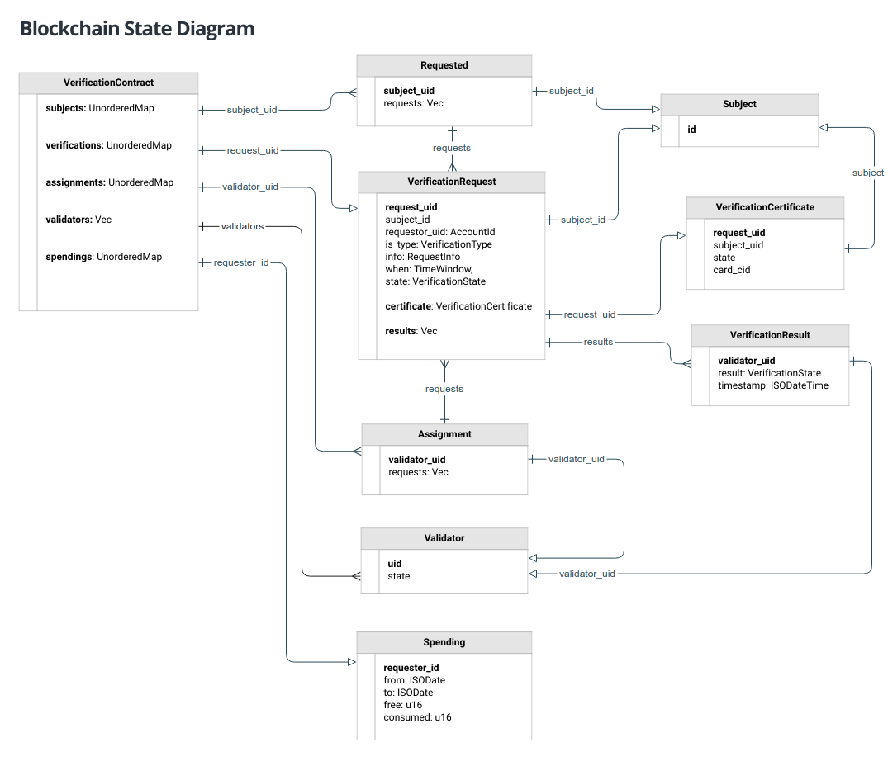

# Blockchain data model

:hand:  This is preliminar work in progress. Some definitions below may change.  It is based on the [first (naive) implementation](../../contracts/README.md#Structures) of the VerificationContract but updated.

The descriptions here follow the RUST conventions and datatypes usage, but in an informal way. The formal definitions will be found in the code in [contracts/src/definitions.rs](../../contracts/src/definitions.rs).

### Custom types ###

**Simple types**

|Custom|RUST Type|Description|
|--|--|--|
| SubjectId | String | The Subject government identification as a string formed using `{country}_{type}_{number}`, ex: `ar_dni_12488353` |
|RequesterId|AccountId| The NEAR AccountId of who made the request, ex: `juanmescher.near` or `5GDZ...ekUj`|
|ValidatorId|AccountId| A NEAR AccountId, ex: `juanmescher.near` or `5GDZ...ekUj`|
|ContentId|String| The IPFS Content ID of a given photo, video or file. |
|ISODateTime|String| A DateTime in ISO-8601 format: `AAAA-MM-DD hh:mm:ss`|
|ISODate|String| A Date in partial ISO-8601 format: `AAAA-MM-DD`|
|TimeWindow|struct| The Time Window in which the verification must be performed `{ starts: ISODateTime,  ends: ISODateTime }`|
|RequestInfo|String| Relevant request information, but fully **encripted**. It will usually be an encripted JSON object, whose contents will dependen on the VerificationType.|

**enum VerificationType**

Enumerates the  different verification services variants:

| Case                | Description                                                  |
| ------------------------- | ------------------------------------------------------------ |
| PoLife              | Validates that the Subject is alive, and lives in the indicated Location. It also implies a ProofOfIdentity. This is a recurrent validation, meaning it must be repeated every month. |
| PoIdentity          | Validates that the Subject is who he says he is, and that is (obviously) alive. |
| PoExistence (asset) | Not implemented, reserved for future use.                    |
| PoState (asset)     | Not implemented, reserved for future use.                    |
| PoOwnership (asset) | Not implemented, reserved for future use.                    |
| PoService (asset)   | Not implemented, reserved for future use.                    |

**enum VerificationState**

Enumerates the different states in which a given request may be. Some requests may require a *why: String* to describe the reason for the given state change.

| Case                 | Description                                                  |
| -------------------- | ------------------------------------------------------------ |
| Pending              | Started but waiting for the validator results. Code ` P`     |
| Approved             | Verification result is approved.  Code ` AP`                 |
| Rejected (why)       | Verification result is Rejected.  Code ` RX`                 |
| NotPossible (why)    | It is not possible to do the verification, due to some reason which exceeds the Validator possibilites, such as inaccesible area, weather, etc. Code `NP` |
| WillNotDo (why)      | Validator will not do the verification, for some personal reason, but it requires a cause and explanation. Too many of this refusals may eliminate the Validator from the validators pool. Code `WND` |
| Canceled (why)       | Verification was canceled by Requestor. Code `CX`            |

**struct VerificationResult**

This struct describes the result reported by a given validator. When the validator has not yet performed the validation, it just describes the assigned task.

| Property     | Type              | Description                                                  |
| ------------ | ----------------- | ------------------------------------------------------------ |
| validator_id | ValidatorId       | The validator account assigned to perform this validation.   |
| result       | VerificationState | The result state. It may be in differente states, depending on the validator actions. |
| timestamp    | ISODateTime       | The timestamp when the validation was performed, or an empty timestamp otherwise. |
| contents | Vec | An array of ContentIDs (photos and videos) attesting the work done. |

**struct VerificationCertificate NFT**

:warning: **URGENT** :warning: MUST define this as soon as possible.

**struct VerificationRequest**

This fully describes a given request for verification. Requests may be of different types, but we currently we will only deal with the PoLife and PoIdentity cases. 

| Property      | Type                    | Description                                                  |
| ------------- | ----------------------- | ------------------------------------------------------------ |
| request_uid   | RequestId               | The current UUID of this request, as given by the caller API or dApp. |
| is_type       | VerificationType        | The verification service required, which may include additional info for some types. |
| requester_uid | AccountId               | This is the account who requested the verification and will pay for it, and is NOT the same as the subject to be verified. |
| subject_id    | SubjectId               | This is the subject to be verified, which is ALLWAYS a real human being. Ccats, dogs and other pets may be considered in the future- |
| info          | RequestInfo             | Relevant request information, but fully **encripted**.       |
| when          | TimeWindow              | The time window in which this verification MUST be performed. |
| state         | VerificationState       | The verification state of the whole request, as a result of the individual verifications. If any of the individual verifications is Rejected, then the whole verification is Rejected. |
| results       | Vec                     | The array [MIN_VALIDATORS..MAX_VALIDATORS] of individual validator VerificationsResults. |
| certificate   | VerificationCertificate | The final certificate emitted by the verification process.   |

**struct Spending**

This struct describes the spending allowed and used in a given time period for a given requester. At the start of each time period (each month), depending on the requester type (`RQ`, `VL` or `XA`) we assign a free quota to each requester. Every time he/she makes a request we discount it from his/her free quota. When no more free quota is available, the requester account must be funded to continue using the service.

| Property     | Type              | Description                                                  |
| ------------ | ----------------- | ------------------------------------------------------------ |
| requester_id | AccountId       | This is the account who requested the verification.   |
| from | ISODate | Starting date for the period, ex: '2022-01-06'.|
| to | ISODate |  Ending date for the period, ex: '2022-30-06'. |
| free | u16 | Quantity of free requests this account can do in the given time period.  |
| consumed | u16 | Quantity of requests this account did in the given time period. | 

### Contract struct VerificationContract ###

This contains the full contract state.

| Property      | Type         | Description                                                  |
| ------------- | ------------ | ------------------------------------------------------------ |
| verifications | UnorderedMap | The pending verifications as an iterable Map keyed by RequestId. When a verification is completed, it must be removed. The value is the VerificationRequest to be performed. |
| subjects      | UnorderedMap | The pending verifications as an iterable Map but keyed by SubjectId, so we avoid traversing the verifications Map to find if a given subject has one or more pending requests. The value is a (variable) array of the pending requests of this particular subject. |
| assignments   | UnorderedMap | The assigned validations, as an iterable Map keyed by ValidatorId. The value is a (variable) array of the RequestIds to be verified by this validator. |
| validators    | Vec          | The Pool of validators, as an array of ValidatorIds.         |
| spendings | UnorderedMap | The spending as an iterable Map keyed by AccountId. The value is the free and used requests quota of this particular account. |

