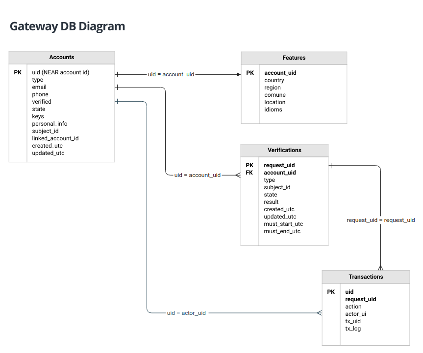
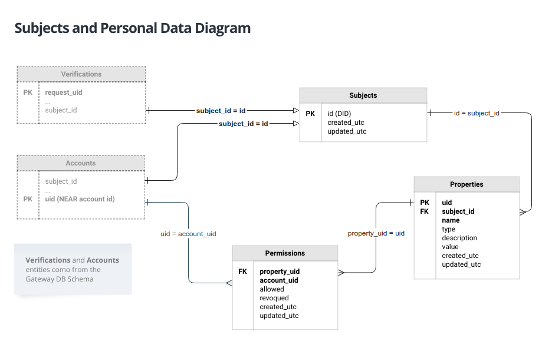

# Gateway DB Data Model

:hand: This is preliminar work in progress and may change in the future. 

We use SQLite3 datatypes to describe the table attributes as they are general and can be easily adapted to other SQL variants.

#### Table `accounts` ####

This table is used mainly for onboarding new users and mantaining registered users linked to its NEAR account and keys. There is also needed for account recovery using email or phone.

|Column name|Datatype|Description|
|--|--|--|
| `uid` | text | UNIQUE NEAR account ID  |
| state | text | `A`: active `I`: Inactive `D`: deleted |
| type | text | `RQ`: Requester, `VL`: Validator, `XA`: External app |
| email | text | Account email |
| phone | text | Account phone |
| keys | blob | **Encripted JSON** account pub/priv keys |
| state | text | `A`: active `I`: Inactive `X`: deleted |
| verified | text | Verification state, `TRUE` or `FALSE` |
| subject_id | text | Subject ID, example: `ar_dni_12345678`, may be empty |
| linked_account_uid | text | A NEAR account ID linked to this account, used by validators to receive payments. |
| created_utc | text | Created UTC time stamp in ISO-8601 format |
| updated_utc | text | Last update UTC time stamp in ISO-8601 format |

The `personal_info` JSON:

| Attribute | Datatype | Description |
| --------- | ----------- | ---- |
|full_name| text | Full person name, may be empty|
|birthday|text| |
|age| integer | autocalculated age using birthday |
|country | text | Country code|
| region | text | Region code (province, state, ...) |
| comune | text | Region subdivisions code (county, Municipio, comuna, etc) code |
| idioms | text | Comma separated list of lang codes |
| address | text | Full address information, expressed as a string which can be used by Maps APIs to find location |
| health | text | free format description of health status if it applies |
| extras | text | additional comments |

#### Table `subjects` ####

This table contains the encripted personal info of all Subjects. This table is needed because a Subject does not need a  NEAR account. Only Requester, Validator an External apps  have one.

|Column name|Datatype|Description|
|--|--|--|
| verified | text | Verification state, `TRUE` or `FALSE` |
| personal_info | text | **Encripted JSON** personal info |
| subject_id | text | Subject ID, example: `ar_dni_12345678`, may be empty |
| created_utc | text | Created UTC time stamp in ISO-8601 format |
| updated_utc | text | Last update UTC time stamp in ISO-8601 format |

The `personal_info` JSON:

| Attribute | Datatype | Description |
| --------- | ----------- | ---- |
|full_name| text | Full person name, may be empty|
|birthday|text| |
|age| integer | autocalculated age using birthday |
|country | text | Country code|
| region | text | Region code (province, state, ...) |
| comune | text | Region subdivisions code (county, Municipio, comuna, etc) code |
| idioms | text | Comma separated list of lang codes |
| address | text | Full address information, expressed as a string which can be used by Maps APIs to find location |
| email | text | Contact email |
| phone | text | Contact email |
| preferred | text | Preferred way to contact this Subject: `WHATSAPP `,`TELEGRAM`,`ONSITE`. |
| health | text | free format description of health status if it applies |
| extras | text | additional comments |

#### Table `Features` ####

This is a helper table is used to select validators, according to certain features, such as country, region, idioms, coordinates, etc. Ideally this table can always be extended or reconstructed from the `personal_info` data.

|Column name|Datatype|Description|
|--|--|--|
| `account_uid` | text | UNIQUE account Uid |
| country | text | Country code |
| region | text | Region code |
| comune | text | Comune code |
| coords | text | GPS Coordinates obtained usinng address |
| idioms | text | Comma separated list of language codes |

#### Table `Verifications` ####

Requested verifications, which can be in different states. This is mainly used as an indexer and linked to one or more BC transactions, as most  info is stored in the BC.

|Column name|Datatype|Description|
|--|--|--|
| `request_uid` | text | UNIQUE request UUID |
| account_uid | text | Account uid which made the request |
| type | text | Request type: `ProofOfLife`, ... |
| subject_id | text | Subject ID, example: `ar_dni_12345678`, may be empty |
| state | text | `PN`: Pending, `ST`: Started, `FI`: Finished |
| result | text | `AP`, `RX`, `NP`, `WND`, `CX` |
| created_utc | text | Created UTC time stamp in ISO-8601 format |
| updated_utc | text | Last update UTC time stamp in ISO-8601 format |
| must_start_utc | text | Must start verification after UTC time stamp in ISO-8601 format |
| must_end_utc | text | Must end verification before UTC time stamp in ISO-8601 format |

#### Table `Transactions` ####

BC transactions linked to some particular request. Note that all transaction info is stored in the BC, here we just maintain a copy of some minimal info.

|Column name|Datatype|Description|
|--|--|--|
| `uid` | text | UNIQUE auto assigned UUID |
| request_uid | text | Request UUID |
| action | text | Transaction action: `RQ`; request, `VL`: validation, `CL`: conclusion |
| actor_uid | text | Actor account uid which participated in this transaction |
| tx_uid | text | Transaction UID in the BC |
| tx_log | text | JSON additional information from TX log |
| created_utc | text | Created UTC time stamp in ISO-8601 format |

#### Table `Sessions` ####

This is  helper table for mantaining the relation with a signup/recovery session_key and  the corresponding passcode sent for aan account signup/recovery/login handshake. Once the passcode has been verified (or rejected) it MUST be removed from the table.

|Column name|Datatype|Description|
|--|--|--|
| `key` | text | The signup/recovery/login session key |
| passcode | integer | A numeric passcode for validating signup/login |
| contact | text | Email or phone used as contact info to signup/recover/login | 
| type | text | `RQ`: Requester, `VL`: Validator, `XA`: External app |
| created_utc | text | Created UTC timestamp in ISO-8601 format |
| expires_utc | text |  Max time for the passcode life, UTC time stamp in ISO-8601 format.  |

## Subjects and Personal Data Access Model ##

:hand: This is preliminar work in progress and may change in the future. 

This takes into account the needs to allow restricted access to some accounts to a subject's personal data. It defines which accounts have been given permission (allowed) to access a certain set of properties (an only those ones).

