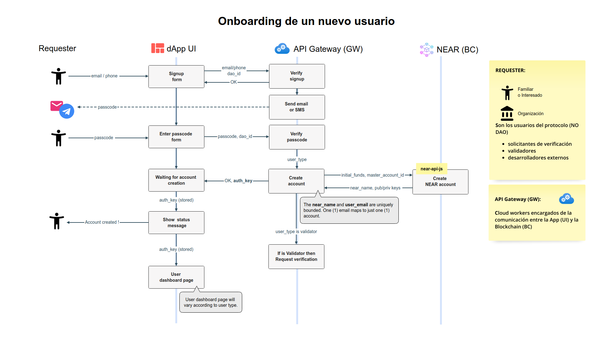
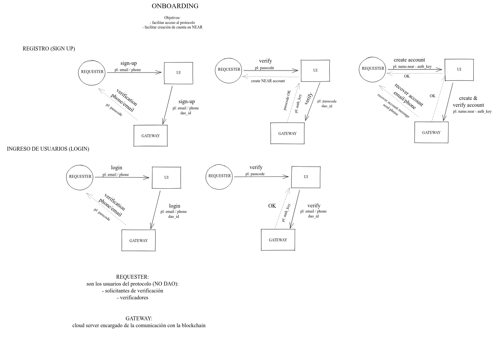

# Onboarding de nuevos usuarios

**Objetivos** 

Utilizaremos técnicas ya conocidas y probadas en la Web2 para conseguir estos objetivos:

- Facilitar el onboarding de nuevos usuarios que no tienen ningún conocimiento del mundo cripto.
- Minimizar la fricción al registrarse, con especial foco en la usabilidad, evitando tener que crear una wallet e ingresar contraseñas.
- Vincular las cuentas en NEAR a correos de los usuarios y acceder a la App usando solo un passcode.
- Permitir que los nuevos usuarios puedan solicitar una verificación en forma inmediata, sin tener que "fondear" sus cuentas.

**Changelog**

- May 23 2022 - @MAZ - documentación final
- May 20-23 2022 - @MAZ, @LM - análisis y revisiones sobre propuesta inicial
- May 19 2020 - @LM - propuesta inicial

## Actores

**Solicitantes (Requester)**: Es quien realiza la solicitud de verificación, que puede ser distinto a la persona que será verificada. Actualmente, limitamos los solicitantes a personas físicas (max dos solicitudes por mes). En el futuro podrían ser organizaciones (muchas solicitudes).

**Sujeto (Subject)**: Es quien será verificado y cuyos datos y resultado quedarán asentados en la BC.

**Validador (Validator)**: Es quien realizará la tarea de verificación en sí misma y reportará el resultado. DEBEN ser personas (no organizaciones) y se limitará la cantidad de verificaciones a un cierto máximo diario.

**Externo (External) y Devs**: Es un desarrollador o una organización que, a través de la API y desde su propia dApp, solicita verificaciones. Inicialmente, se limitará la cantidad de verificaciones a un cierto máximo diario a determinar.

**App o Frontend (aka UI)**: la aplicación que corre en el navegador del usuario y que interactúa con el mismo.

**Gateway (aka GW)**: un servicio que actúa como mediador entre la App (UI) y los contratos en la Blockchain (BC). 

**Blockchain contracts (aka BC)**: los "smart contracts" creados sobre la Blockchain (NEAR en nuestro caso).

## Cuentas

La interacción entre la UI y el GW se produce utilizando `una cuenta NEAR por cada usuario registrado`. Estas cuentas residen exclusivamente en el GW, y tienen las siguientes características:

- La cuenta se crea durante el proceso de Onboarding usando email o telefono. 

- El nombre de la cuenta se asignará automaticamente, usando la convención de cuentas implícitas de NEAR: [Implicit Accounts | NEAR Documentation](https://docs.near.org/docs/roles/integrator/implicit-accounts) que se menciona más abajo

- En el GW se guardan los datos de la cuenta, su **account_id** y su **vinculación unívoca con el email o teléfono** y su conjunto de claves (public/private).

- Las cuentas solo son accesibles *dentro* del GW. Los usuarios no conocen sus claves públicas ni privadas y NO tienen acceso a las mismas. 

- Las cuentas se fondearán inicialmente con el monto necesario para cubrir dos (2) verificaciones.

- Un usuario con un wallet de NEAR puede fondear esta cuenta para habilitar más verificaciones, desde sus propias cuantas a las cuentas así creadas.

#### Asignación de nombres de cuentas

Los nombres de cuentas serán asignadas por el GW del modo en que se asignan la cuentas implicitas en NEAR [Implicit Accounts | NEAR Documentation](https://docs.near.org/docs/roles/integrator/implicit-accounts)

> Implicit accounts work similarly to Bitcoin/Ethereum accounts.
> - They allow you to reserve an account ID before it's created by generating a ED25519 key-pair locally.
> - This key-pair has a public key that maps to the account ID.
> - The account ID is a lowercase hex representation of the public key.
> - An ED25519 Public key contains 32 bytes that maps to 64 characters account ID.
> - The corresponding secret key allows you to sign transactions on behalf of this account once it's created on chain.

El `account_id` de la cuenta es su clave pública: `BGCCDDHfysuuVnaNVtEhhqeT4k9Muyem3Kpgq2U1m9HX`.

#### Uso del Gateway (GW) por parte de la App (UI)

Cuando un usuario fue dado de alta, se generará para el mismo una `AUTH_KEY` que se guardará en el almacenamiento local de su navegador (`localStorage`), en forma similar a como opera el wallet de NEAR.

Mientras esté conectado, la UI usará esta AUTH_KEY para interactuar con el GW, pasando la AUTH_KEY en el header  `Authorization = Bearer AUTH_KEY` en cada llamado al GW.

Si cierra la ventana del navegador, y vuelve a abrir la App en un momento futuro, se lee la AUTH_KEY del `localStorage` y se puede seguir trabjando igual que antes, sin necesidad de conectarse nuevamente. 

Si eligiera desconectarse, o borrar completamente el `localStorage` (por ej: borrando todas sus cookies) deberá logearse nuevamente enviando su email, esperando el passcode que enviará el GW e ingresando el passcode recibido. Esto vuelve a generar otra AUTH_KEY con la cual ya puede continuar trabajando o realizar nuevas solicitudes.

#### Uso de la API por parte de usuarios externos

Cuando un usuario externo desea usar la API de Identicon, se debe registrar inicialmente como cualquier otro usuario. 

Obtendra así una `API_KEY` (similar a como funcionan muchas APIs) y además dispondrá del nombre de la cuenta creada para su uso. La información estará disponible en su Tablero personal, desde donde puede renovar su API_KEY.

Para usar la API deberá usar esta API_KEY pasando el header  `Authorization = Bearer API_KEY` en el cada llamado.

Debido a que las cuentas se fondearán inicialmente solo con el monto necesario para cubrir dos (2) verificaciones, y esto puede ser insuficiente para una API, la App que usa la API puede fondear esta cuenta cuando lo necesite. O podríamos facturar servicios contra el consumo de dicha cuenta.

#### Datos básicos de una cuenta 

En el GW se resguardan los datos básicos de la cuenta y su relación con el email, por ejemplo:

|type|email|account_id|verified|auth_key|account_keys|
|--|--|--|--|--|--|
| R |marux2022@gx.com|BGCC...m9HX|false|eyJh...B3wk|{"pub":"...","priv":"..."}|
| S |mlauvalez@gx.com|ACCC...67HX|true|ecff...B3wk| {...}                            |
| V |jperez2021@gx.com|DECC...yzHX|true|abcd...B3wk| {...}                            |
| X |dev@someone.com|0123...nmUV|true|eNMO...B3wk| {...}|

Donde `type`:

- `R`: Requester

- `S`: Subject

- `V`: Validator

- `X`: Extern

## Flujo de mensajes 

El flujo final del Onboarding de un nuevo usuarios:

## Propuesta 

El flujo e interacciones se detalla en el siguiente diagrama:

