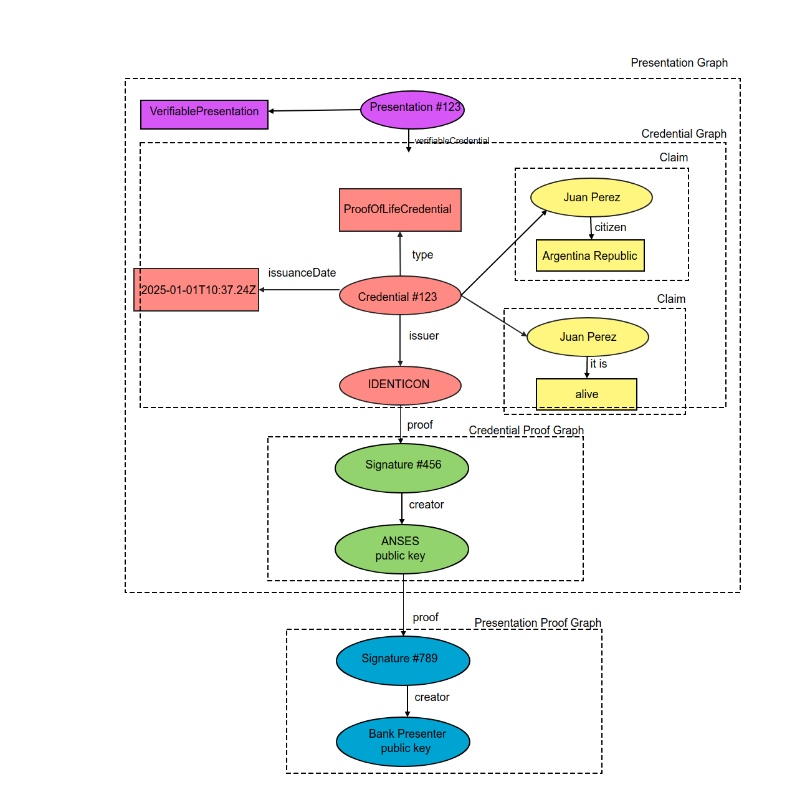

# Verifiable Credential

## What is a *verifiable credential*?

As conceptualized and standardized by the W3C, the verifiable credential can represent all of the same information that a physical credential represents. The addition of technologies, such as digital signatures, makes verifiable credentials more tamper-evident and more trustworthy than their physical counterparts.

Holders of verifiable credentials can generate verifiable presentations and then share these verifiable presentations with verifiers to prove they possess verifiable credentials with certain characteristics.

Both verifiable credentials and verifiable presentations can be transmitted rapidly, making them more convenient than their physical counterparts when trying to establish trust at a distance.

## What are the roles on a Verifiable Credential Ecosystem?

Describe the roles of the core actors and the relationships between them in an ecosystem where verifiable credentials are expected to be useful. A role is an abstraction that might be implemented in many different ways.

### holder
A role an entity might perform by possessing one or more verifiable credentials and generating verifiable presentations from them. Example holders include students, employees, and customers.

### issuer
A role an entity performs by asserting claims about one or more subjects, creating a verifiable credential from these claims, and transmitting the verifiable credential to a holder. Example issuers include corporations, non-profit organizations, trade associations, governments, and individuals.

**Identicon will act on behalf on the issuer**

### subject
An entity about which claims are made. Example subjects include human beings, animals, and things. In many cases the holder of a verifiable credential is the subject, but in certain cases it is not. For example, a parent (the holder) might hold the verifiable credentials of a child (the subject), or a pet owner (the holder) might hold the verifiable credentials of their pet (the subject). For more information about these special cases.

### verifier
A role an entity performs by receiving one or more verifiable credentials, optionally inside a verifiable presentation, for processing. Example verifiers include employers, security personnel, and websites.

### verifiable data registry
A role a system might perform by mediating the creation and verification of identifiers, keys, and other relevant data, such as verifiable credential schemas, revocation registries, issuer public keys, and so on, which might be required to use verifiable credentials. Some configurations might require correlatable identifiers for subjects.
Example verifiable data registries include trusted databases, decentralized databases, government ID databases, and distributed ledgers. Often there is more than one type of verifiable data registry utilized in an ecosystem.

**Identicon will use the NEAR blockchain to represent the verifiable data registry**

## Core Data Model

The following sections outline core data model concepts, such as claims, credentials, and presentations, which form the foundation of this specification.

### Claim
A claim is a statement about a subject. A subject is a thing about which claims can be made. Claims are expressed using subject- property-value relationships.

For example, whether someone graduated from a particular university can be expressed as shown in Figure 3 below.

### Credential
A credential is a set of one or more claims made by the same entity. Credentials might also include an identifier and metadata to describe properties of the credential, such as the issuer, the expiry date and time, a representative image, a public key to use for verification purposes, the revocation mechanism, and so on. The metadata might be signed by the issuer. A verifiable credential is a set of tamper-evident claims and metadata that cryptographically prove who issued it.

#### Metadata
Cryptographically signed by the issuer. It “describe[s] properties of the credential, such as the issuer, the expiry date and time, a representative image, a public key to use for verification purposes, the revocation mechanism, and so on.” (W3C)

#### Proofs
A proof is data about yourself (the identity holder) that allows others to verify the source of the data (i.e the issuer), check that the data belongs to you (and only you), that the data has not been tampered with, and finally, that the data has not been revoked by the issuer.

### Verifiable credential example : “Fe de vida” (Proof of Life )

##### Holder:  Argentina Citizen
##### Issuer: Identicon on behalf of ANSES
##### Verifier: Bank Entity - try to ensure proof of life for pension claiming

### Verifiable Presentations

Enhancing privacy is a key design feature of this specification. Therefore, it is important for entities using this technology to be able to express only the portions of their persona that are appropriate for a given situation. The expression of a subset of one's persona is called a verifiable presentation. Examples of different personas include a person's professional persona, their online gaming persona, their family persona, or an incognito persona.

A verifiable presentation expresses data from one or more verifiable credentials, and is packaged in such a way that the authorship of the data is verifiable. If verifiable credentials are presented directly, they become verifiable presentations. Data formats derived from verifiable credentials that are cryptographically verifiable, but do not of themselves contain verifiable credentials, might also be verifiable presentations.

The data in a presentation is often about the same subject, but might have been issued by multiple issuers. The aggregation of this information typically expresses an aspect of a person, organization, or entity.

#### Example Verifiable Presentation

##### Holder:  Argentina Citizen
##### Issuer: Identicon on behalf of ANSES
##### Verifier: Bank Entity - try to ensure proof of life for pension claiming

## NFTs and Verifiable Credentials (VC)

### Similarities between an NFT and a VC

#### Leverages the Digital World
NFTs, in particular, give owners new revenue streams and ways to monetize. For example, a music band can create an exclusive single and sell it as an NFT, so the new owner has the rights to all royalties arising from it.
VCs also leverage the digital infrastructure to eliminate the frauds that arise in the physical world by converting all important credentials into an easy-to-share digital format. A startup company, for example, can take the responsibility of converting the physical identities into secure digital ones, and in turn, charge a fee to the owner of the credential for this service.

#### Unique Identification
Both NFTs and VCs are used to uniquely identify something that belongs to an entity. NFTs are often implemented to represent a unique piece of art or a collectible that belongs to an entity. It proves that a particular item is authentic as claimed and belongs only to an entity. For example, an NFT can be used to prove that Lisa is the owner of a collectible Pokemon card.

VCs are also used to prove that a claim made by an entity is true. This claim can be credentials such as PII, university degree, and more. In this case, a gaming club can issue a VC to Lisa to claim that she is the head of their pokemon meetup club.
In this sense, both NFTs and VCs prove that something belongs to an entity and this could be anything from a PII to a piece of art.

#### Inmutable
The implementation of both NFTs and VCs ensures that the records are immutable, and hence, this adds another layer of security to these tokens and credentials.
Thus, these are some of the similarities between NFTs and VCs
